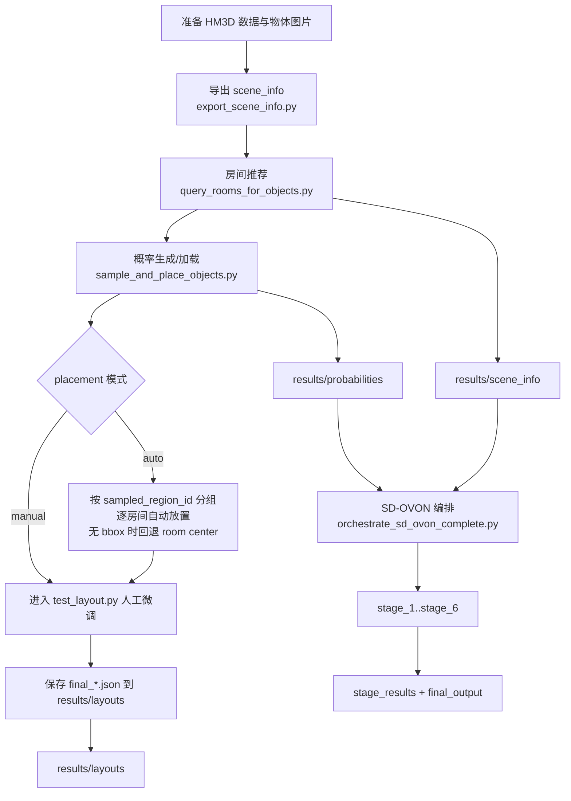

# HM3D 语义布局主线 + SD-OVON 链路协同流程（自动放置版）

## 1. 目标与范围

本文档汇总以下能力的端到端协同运行流程：

- HM3D 语义布局主线：房间推荐 -> 概率生成/读取 -> 自动放置或人工微调 -> 最终布局保存。
- SD-OVON 编排链路：语义理解 -> 特征预处理 -> 对象生成 -> 实例融合 -> 去重 -> 语义放置 -> 物理检查 -> 校验。
- 协同运行：SD-OVON 消费 HM3D 主线产出的 rooms/probabilities 数据目录。

自动放置能力支持区域约束：

- 每个物体先通过概率采样得到 `sampled_region_id`。
- 自动放置按房间分组依次处理：先筛选出该房间的物体，再在该房间内依次放置。
- 当该物体目标房间无有效 bbox 时，自动降级到该房间 room center 附近采样（已内置）。

---

## 2. 环境与前置检查

在项目根目录执行：

```bash
python verify_workflow.py
```

建议安装依赖：

```bash
pip install openai numpy
```

若需要编辑器交互微调（`test_layout.py`）：

```bash
pip install opencv-python
# habitat-sim / magnum 依赖按你的环境安装
```

若需要远程 Qwen3-VL（SSH 密码方式）：

```bash
# Linux 示例
sudo apt-get install -y sshpass
```

---

## 3. 整体流程图（协同版）



---

## 4. 步骤化命令（可直接执行）

### Step 0：准备输入

- 场景数据在 `hm3d/`。
- 物体图片放在 `objects_images/`。
- 物体模板在 `objects/`。

可选：一键整理 HM3D minival 并导出信息。

```bash
python run_hm3d_pipeline.py
```

---

### Step 1：导出场景语义信息（可选但推荐）

单场景：

```bash
python export_scene_info.py --scene 00808-y9hTuugGdiq
```

全量：

```bash
python export_scene_info.py --all
```

---

### Step 2：生成房间推荐（rooms.json）

单场景示例：

```bash
python query_rooms_for_objects.py \
  --ssh-host <SSH_HOST> --ssh-port <SSH_PORT> --ssh-user <SSH_USER> --ssh-password <SSH_PASSWORD> \
  --vllm-host 127.0.0.1 --vllm-port 8000 \
  --images-dir ./objects_images \
  --scene 00808-y9hTuugGdiq \
  --output-dir ./results/scene_info/
```

产物目录：

- `results/scene_info/<scene>/<object>_rooms.json`

---

### Step 3：HM3D 主线采样与放置

#### 3.1 自动放置（推荐协同模式）

按每个物体采样出的目标房间自动放置（逐房间处理）：

```bash
python sample_and_place_objects.py \
  --scene 00808-y9hTuugGdiq \
  --mode generate \
  --images-dir ./objects_images \
  --rooms-info-dir ./results/scene_info \
  --probabilities-dir ./results/probabilities \
  --layouts-dir ./results/layouts \
  --placement auto \
  --placement-backend rule \
  --placement-attempts 24
```

读取已生成概率并自动放置示例：

```bash
python sample_and_place_objects.py \
  --scene 00808-y9hTuugGdiq \
  --mode load \
  --probabilities-dir ./results/probabilities \
  --layouts-dir ./results/layouts \
  --placement auto
```

行为说明：

- 每个物体先从其概率分布采样出目标房间（`sampled_region_id`）。
- 按房间分组依次处理：同一房间中的物体连续放置。
- 优先在该房间 bbox 内采样。
- 如果该房间 bbox 无效，则自动回退到该房间 room center 附近采样。
- 失败对象会被标记为 `needs_manual_fix` 并在编辑器中优先复核。

#### 3.2 人工微调模式

```bash
python sample_and_place_objects.py \
  --scene 00808-y9hTuugGdiq \
  --mode load \
  --probabilities-dir ./results/probabilities \
  --layouts-dir ./results/layouts \
  --placement manual
```

---

### Step 4：运行 SD-OVON 编排链路

#### 4.1 快速协同检查（mock）

```bash
python -c "from orchestrate_sd_ovon_complete import SDOVONPipelineOrchestrator as O; r=O('mock').run_full_pipeline('00808-y9hTuugGdiq'); print(r['pipeline_status'], r['final_output'])"
```

#### 4.2 生产模式（依赖齐全时）

```bash
python -c "from orchestrate_sd_ovon_complete import SDOVONPipelineOrchestrator as O; r=O('production').run_full_pipeline('00808-y9hTuugGdiq'); print(r['pipeline_status'], r['final_output'])"
```

说明：

- `orchestrate_sd_ovon_complete.py` 会读取：
  - `results/scene_info/<scene>/*_rooms.json`
  - `results/probabilities/<scene>/*_probs.json`
- 若 rooms/probabilities 为空，stage_1 或 stage_2 可能无有效数据，最终 `objects_placed` 会为 0。

---

## 5. 协同运行验收清单

按顺序检查：

1. `python verify_workflow.py` 通过。
2. `results/scene_info/<scene>/` 下存在 `*_rooms.json`。
3. `results/probabilities/<scene>/` 下存在 `*_probs.json`。
4. `sample_and_place_objects.py --placement auto` 能输出临时布局并进入编辑器。
5. 最终布局写入 `results/layouts/<scene>/final_*.json`。
6. `orchestrate_sd_ovon_complete.py` 的 `stage_results` 中：
   - `stage_1_semantic_understanding.success == True`
   - `stage_5_semantic_placement.objects_placed > 0`（依赖上游数据）

---

## 6. 常见问题与排查

### Q1：SD-OVON 显示 completed_with_errors，且 objects_placed=0

排查：

- 检查 `results/scene_info/<scene>/` 是否有 `*_rooms.json`。
- 检查 `results/probabilities/<scene>/` 是否有 `*_probs.json`。
- 先补跑 Step 2 和 Step 3。

### Q2：自动放置失败对象多

排查：

- 增大 `--placement-attempts`（例如 48）。
- 检查 `results/probabilities/<scene>/*_probs.json` 中各物体是否有足够的候选房间。
- 不要强行使用过大的 `--collision-radius-override`。

### Q3：编辑器无法启动

排查：

- 安装 `opencv-python`。
- 检查 `habitat-sim` 与 `magnum` 环境可用。

---

## 7. 推荐的最小协同命令集合

```bash
python verify_workflow.py

python query_rooms_for_objects.py \
  --ssh-host <SSH_HOST> --ssh-port <SSH_PORT> --ssh-user <SSH_USER> --ssh-password <SSH_PASSWORD> \
  --vllm-host 127.0.0.1 --vllm-port 8000 \
  --images-dir ./objects_images \
  --scene 00808-y9hTuugGdiq \
  --output-dir ./results/scene_info/

python sample_and_place_objects.py \
  --scene 00808-y9hTuugGdiq \
  --mode generate \
  --rooms-info-dir ./results/scene_info \
  --probabilities-dir ./results/probabilities \
  --layouts-dir ./results/layouts \
  --placement auto

python -c "from orchestrate_sd_ovon_complete import SDOVONPipelineOrchestrator as O; r=O('mock').run_full_pipeline('00808-y9hTuugGdiq'); print(r['pipeline_status'], r['final_output'])"
```

以上流程跑通后，再切换 production 模式和更复杂场景。
