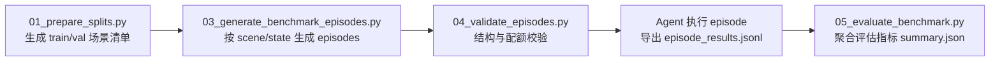

# HM3D 物体房间推理与概率采样布局系统

## 项目简介

本项目围绕两个核心脚本构建完整流程：

1. query_rooms_for_objects.py：对物体图片调用 Qwen3-VL，输出该物体在场景中最可能出现的房间候选（前 2-5 个，含 region_id、room_center、confidence_score）。
2. sample_and_place_objects.py：读取或生成概率分布，按概率采样每个物体的位置，调用 test_layout.py 进行人工微调并保存最终布局。

完整流程：
物体图片 -> 房间推荐 -> 概率分布 -> 采样初始布局 -> 人工微调 -> 最终布局

##！！！人工微调注意事项
每个房间都有可能会被分配一定数量的物体。
你需要做的就是把物体放置在房间内合理的位置。
如果发现房间无法放置该物体，可以按B删除。

未完成事项：
1.添加调整步长的按键。
2.添加更多场景/物体。

## 目录结构

输入目录：
- hm3d 场景数据：hm3d/minival/{scene}/...
- 物体图片目录：objects_images/
- 物体模板目录：objects/（*.object_config.json）

输出目录：
- 房间推荐：results/scene_info/{scene}/{object}_rooms.json
- 概率分布：results/probabilities/{scene}/{object}_probs.json
- 布局结果：results/layouts/{scene}/final_*.json

## 依赖安装

基础依赖：
- openai
- numpy

可选依赖：
- habitat-sim（实时导出 scene_info 时需要）
- sshpass（使用 SSH 密码模式时需要）

安装示例：
pip install openai numpy
pip install habitat-sim

## 脚本一：query_rooms_for_objects.py

### 功能
- 连接远程 vLLM Qwen3-VL（SSH 隧道）
- 读取场景房间候选
- 对每张物体图片生成房间推荐 JSON

### 关键参数
- --scene：单场景（与 --scenes 互斥）
- --scenes all：全量场景（与 --scene 互斥）
- 两者都不填：默认处理 AVAILABLE_SCENES 全量
- --ssh-host / --ssh-port / --ssh-user：SSH 必要参数
- --ssh-password 或 --ssh-key：二选一认证方式
- --images-dir：图片目录，默认 ./objects_images
- --output-dir：输出目录，默认 ./results/scene_info
- --vllm-host / --vllm-port：默认 127.0.0.1:8000
- --model：默认 Qwen/Qwen3-VL-235B-A22B-Thinking
- --timeout：默认 3600 秒

### 单场景示例
python query_rooms_for_objects.py \
  --ssh-host 7.216.187.6 --ssh-port 31822 --ssh-user root --ssh-password 666666 \
  --vllm-host 127.0.0.1 --vllm-port 8000 \
  --images-dir ./objects_images \
  --scene 00808-y9hTuugGdiq \
  --output-dir ./results/scene_info/

### 全量场景示例
python query_rooms_for_objects.py \
  --ssh-host 7.216.187.6 --ssh-port 31822 --ssh-user root --ssh-password 666666 \
  --scenes all \
  --output-dir ./results/scene_info/

## 脚本二：sample_and_place_objects.py

### 功能
- 基于 rooms.json 生成或加载概率
- 为每个物体采样 1 个房间中心作为初始位置
- 调用编辑器微调并保存最终布局
- 支持 `--placement auto` 在指定 `--region-ids` 的房间/区域内自动放置

### 关键参数
- --scene：必填
- --mode：load 或 generate，默认 load
- --images-dir：默认 ./objects_images
- --rooms-info-dir：默认 ./results/scene_info
- --probabilities-dir：默认 ./results/probabilities
- --layouts-dir：默认 ./results/layouts
- --placement：manual 或 auto，默认 manual
- --region-ids：逗号分隔的 region_id，例如 3 或 3,7,9；不填则不限制范围
- --ui-lang：zh 或 en，默认 zh

### 首次运行（生成概率）
python sample_and_place_objects.py \
  --scene 00808-y9hTuugGdiq \
  --mode generate \
  --images-dir ./objects_images \
  --rooms-info-dir ./results/scene_info \
  --probabilities-dir ./results/probabilities \
  --layouts-dir ./results/layouts \
  --placement auto \
  --region-ids 3

### 后续迭代（读取已有概率）
python sample_and_place_objects.py \
  --scene 00808-y9hTuugGdiq \
  --mode load \
  --probabilities-dir ./results/probabilities \
  --layouts-dir ./results/layouts \
  --placement manual

## JSON 输出结构

### 房间推荐文件
路径：
results/scene_info/{scene}/{object}_rooms.json

主要字段：
- scene_info：场景名、图片名、时间、模型
- raw_output / cleaned_output
- recommended_rooms：
  - rank
  - region_id
  - room_center [x,y,z]
  - confidence_score
  - reasoning
  - room_aabb（如可用）
- metadata：场景对象数、房间数、返回候选数量

### 概率文件
路径：
results/probabilities/{scene}/{object}_probs.json

主要字段：
- object_name
- scene_name
- probabilities[]：
  - rank
  - region_id
  - room_center
  - probability（同一物体总和为 1）

### 布局文件
路径：
results/layouts/{scene}/final_*.json

主要字段：
- scene
- timestamp
- objects[]：
  - id
  - model_id
  - name
  - position
  - rotation
  - confidence
  - source

## HM3D / 语义要点

- semantic.txt 格式：object_id, color_hex, category, region_id
- region_id 表示房间编号
- 房间中心来自 room bounding_box 的中心计算
- 场景信息可由 export_scene_info.py 导出（scene_info/categories/rooms/objects）

## 常见问题

1. 同时传 --scene 和 --scenes all 报错
原因：二者互斥。请只保留一个，或都不填（默认全量）。

2. 报 sshpass not found
安装 sshpass 或改用 --ssh-key。

3. 房间推荐为空或不足 2 个
检查图片质量、Qwen 服务状态、scene_info 可用性；脚本有回退补足逻辑。

4. 编辑器加载不到模型
确认 objects_images 文件名与 objects 模板可映射（脚本已做 _4k 别名映射）。

5. Python 版本注解报错
脚本已使用 from __future__ import annotations，建议 Python 3.8+。

## 推荐执行顺序

1. 准备 objects_images 图片
2. 运行 query 脚本生成 rooms.json
3. 运行 sample 脚本 generate 模式
4. 在编辑器中微调并保存
5. 后续使用 load 模式快速迭代

## 最小可运行示例

目标：用 1 张图片在 1 个场景里跑通从推荐到采样再到人工微调的全流程。

### 1）准备最小输入

- 场景：00808-y9hTuugGdiq
- 图片：objects_images/mug_01.jpg（文件名即物体名）

目录最小形态：

objects_images/
  mug_01.jpg

### 2）生成房间推荐（Qwen）

python query_rooms_for_objects.py \
  --ssh-host 7.216.187.6 --ssh-port 31822 --ssh-user root --ssh-password 666666 \
  --vllm-host 127.0.0.1 --vllm-port 8000 \
  --images-dir ./objects_images \
  --scene 00808-y9hTuugGdiq \
  --output-dir ./results/scene_info/

预期产物：

results/scene_info/00808-y9hTuugGdiq/mug_01_rooms.json

### 3）首次采样并打开编辑器（generate）

python sample_and_place_objects.py \
  --scene 00808-y9hTuugGdiq \
  --mode generate \
  --images-dir ./objects_images \
  --rooms-info-dir ./results/scene_info \
  --probabilities-dir ./results/probabilities \
  --layouts-dir ./results/layouts \
  --ui-lang zh

执行后会自动进入 test_layout.py：

- 用按键调整物体位置
- 按 M 保存
- 关闭窗口返回终端

预期新增产物：

- results/probabilities/00808-y9hTuugGdiq/mug_01_probs.json
- results/layouts/00808-y9hTuugGdiq/final_*.json

## Benchmark 完整生成流程

本工程 benchmark 以 episode 为核心单位，完整链路如下：



### Benchmark 相关文件

- benchmark/schemas.py：Episode/SceneState/Subtask 数据结构和校验
- benchmark/metrics.py：success rate、SPL、效率等聚合指标
- scripts/01_prepare_splits.py：生成 split manifest
- scripts/03_generate_benchmark_episodes.py：批量生成 episode JSON
- scripts/04_validate_episodes.py：验证配额和子任务分布
- scripts/05_evaluate_benchmark.py：汇总 jsonl 评测结果

### 输入依赖

- 语义场景目录：hm3d-minival-* 或 hm3d/ 下可解析场景
- 可选对象来源：results/probabilities/{scene}/*_probs.json
- 若缺少概率文件，03 脚本会回退到内置默认对象名

### 第 1 步：生成 split 清单

```bash
python scripts/01_prepare_splits.py \
  --train-count 60 \
  --val-count 20 \
  --seed 42 \
  --output benchmark/splits/benchmark_split_v1.json
```

可选参数：

- --allow-reuse-scenes：当可用场景总数不足时允许复用场景（仅建议冒烟测试使用）

输出：

- benchmark/splits/benchmark_split_v1.json

### 第 2 步：dry-run 估算规模

```bash
python scripts/03_generate_benchmark_episodes.py \
  --split-manifest benchmark/splits/benchmark_split_v1.json \
  --states-per-scene 15 \
  --train-episodes-per-scene 5000 \
  --val-episodes-per-scene 10 \
  --dry-run
```

dry-run 只计算数量，不写文件。建议每次改参数后先跑一次。

### 第 3 步：正式生成 episodes

```bash
python scripts/03_generate_benchmark_episodes.py \
  --split-manifest benchmark/splits/benchmark_split_v1.json \
  --states-per-scene 15 \
  --train-episodes-per-scene 5000 \
  --val-episodes-per-scene 10 \
  --output-root benchmark/episodes/v1
```

输出目录结构：

```text
benchmark/episodes/v1/
  train/{scene}/state_XX/{episode_id}.json
  val/{scene}/state_XX/{episode_id}.json
```

### 第 4 步：校验结构与配额

```bash
python scripts/04_validate_episodes.py \
  --episodes-root benchmark/episodes/v1 \
  --expected-train-scenes 60 \
  --expected-val-scenes 20 \
  --expected-states-per-scene 15 \
  --expected-train-episodes-per-scene 5000 \
  --expected-val-episodes-per-scene 10
```

校验内容：

- split 目录和场景数量
- 每个场景的 state 数量
- 每个场景总 episode 数
- 子任务数量范围（5-10）
- 子任务类型平衡性（open_vocab/image_goal/language_goal 差值不超过 1）

### 第 5 步：执行评测并汇总

首先由你的 agent/策略执行 episode，产出逐条 jsonl（每行一个 episode 结果）。

然后汇总：

```bash
python scripts/05_evaluate_benchmark.py \
  --input benchmark/eval/episode_results.jsonl \
  --output benchmark/eval/summary.json
```

输入 jsonl 每行建议至少包含：

- success
- path_length
- shortest_path_length
- elapsed_seconds
- dynamic_memory_correct
- dynamic_memory_total
- fixed_memory_correct
- fixed_memory_total
- steps

### 快速复跑布局（与 benchmark 并行）

```bash
python sample_and_place_objects.py \
  --scene 00808-y9hTuugGdiq \
  --mode load \
  --probabilities-dir ./results/probabilities \
  --layouts-dir ./results/layouts
```

load 模式复用已有概率文件，适合快速迭代场景布局，不影响 benchmark 数据集生成流程。

## Benchmark 常见问题

1. 报错 "Need X scenes, but only Y available"
   - 降低 --train-count/--val-count，或临时使用 --allow-reuse-scenes。

2. 生成很慢或磁盘占用大
   - 先使用 --dry-run 调整参数，再下调 --train-episodes-per-scene。

3. 校验失败：subtask mix unbalanced
   - 检查自定义生成逻辑是否破坏了三类子任务均衡约束。

4. 评估 summary 数值异常（如 SPL 为 0）
   - 检查 jsonl 中 shortest_path_length 是否写入，且大于 0。
